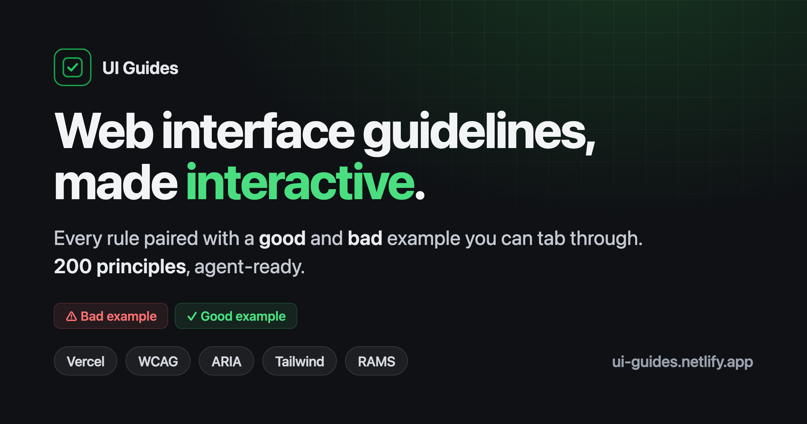

# UI Guides

Web interface guidelines, made interactive. Every rule paired with a **good** and **bad** example you can actually tab through — plus copy-paste rules for coding agents.

**→ [ui-guides.netlify.app](https://ui-guides.netlify.app)**



## What it is

**The rules are not mine.** They come from other people's agent skills and guidelines — Vercel's `web-design-guidelines`, [Rauno Freiberg](https://interfaces.rauno.me), [@Ibelick's UI Skills](https://www.ui-skills.com/), [impeccable.style](https://impeccable.style/), [Emil Kowalski's animation skills](https://emilkowalski.com/), Tailwind, [RAMS](https://www.rams.ai/). Good guidance, scattered across a dozen skill files, README bullets, and markdown lists you'd otherwise hunt down one at a time.

**The work here is extraction and wiring.** Every rule is pulled into a single corpus, then given three things it didn't have:

1. **A good and a bad example you can operate** — real components, not screenshots. Tab through both. Feel the difference between a missing focus ring and a clear one, or a form that eats your paste and one that doesn't.
2. **A `MUST` / `SHOULD` / `NEVER` rule** an agent can paste straight into its context.
3. **A link back to where it came from**, so credit stays attached to the rule.

300+ principles across eight categories — interactions, animations, layout, content, forms, performance, design, aesthetics. Search, filter by source or tag, deep-link to any rule.

**To use it:** point a coding agent at [`llms-full.txt`](https://ui-guides.netlify.app/llms-full.txt) — the whole corpus as plain text, no JavaScript required.

## What's inside

- **300+ principles**, each with a side-by-side good/bad example you can operate — not screenshots, real components.
- **Multi-source and attributed.** Every rule is tagged with the upstream project it came from, filterable by origin, and credited on the Sources page.
- **Agent-ready rules.** Every principle carries a `MUST` / `SHOULD` / `NEVER` rule with a code snippet, written to be copy-pasted straight into a coding agent's context. One click to copy.
- **Fetchable by agents.** The whole corpus is published as [`llms-full.txt`](https://ui-guides.netlify.app/llms-full.txt) — plain text, no JavaScript, generated from the principle data at build time. Point a coding agent at it directly.
- **Keyboard-first, accessible, themed.** The guide practices what it documents: visible focus rings, focus traps, hit targets, `prefers-reduced-motion`, light/dark, dynamic page titles.

## Built with

React 18 · TypeScript (strict) · Vite · Tailwind v4 · MDX · Radix UI + shadcn/ui · Motion · HugeIcons

Principles live as MDX in `content/principles/`. Example components auto-discover from `src/components/examples/` via `import.meta.glob` — drop a `NameGood.tsx` / `NameBad.tsx` in the right folder and it wires itself up. See [`CLAUDE.md`](./CLAUDE.md) for the full architecture.

## Run it

```bash
npm install
npm run dev          # vite dev server
npm run build        # production build → dist/
npm run typecheck    # tsc, strict
npm run lint         # eslint
npm test             # vitest
```

## Credits

The principles belong to their authors — [Vercel](https://github.com/vercel-labs/agent-skills), [Rauno Freiberg](https://interfaces.rauno.me), [@Ibelick](https://www.ui-skills.com/), [impeccable.style](https://impeccable.style/), [Tailwind](https://tailwindcss.com/docs), [RAMS](https://www.rams.ai/), [Emil Kowalski](https://emilkowalski.com/) — who did the thinking. Attribution is preserved per-rule in the source badges and on the Sources page.

The corpus, the good/bad examples, and the agent-rule phrasings are the original contribution here. Extraction and wiring, not authorship.

Built by [Gleb Stroganov](https://glebstroganov.com) — design engineer, developer tools & AI. One of the [explorations](https://glebstroganov.com/explorations).
